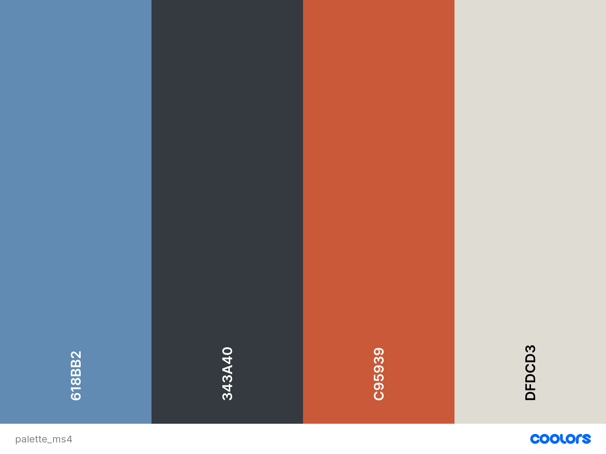
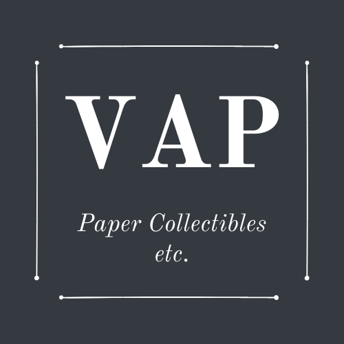

# VAP - Vintage Art Prints

Am I responsive

**[Live demo](https://jochenfm-art-prints.herokuapp.com/)**

## Table of Contents

- <a href="#context">Context</a>
- <a href="#ux">UX</a>
  - <a href="#ux-overview">Overview</a>
  - <a href="#ux-stories">User stories</a>
  - <a href="#ux-wireframes">Wireframes</a>
  - <a href="#ux-design">Design</a>
- <a href="#database-model">Database model</a>
- <a href="#features">Features</a>
  - <a href="#features-current">Existing Features</a>
  - <a href="#features-future">Future Features</a>
- <a href="#technologies">Technologies Used</a>
- <a href="#testing">Testing</a>
- <a href="#deployment">Deployment</a>
- <a href="#credits">Credits</a>
---

## Context

VAP - Vintage Art Prints allows trade of and information exchange on a fine selection of original art prints from around the globe. 
The project also publishes blog posts for users to exchange information on the paper art advertised and help an online community of paper art traders and affictionados grow. The current focus is on paper collectibles, so-called “Mono-Karten” or “Monos”, advertising cards developed from around 1905 by Swiss editor and entrepreneur Karl Wilhelm Bührer (1861-1917) under the aegis of International Mono Society, equally founded by Bührer in Winterthur, Switzerland. 
But the product range can be expanded later on with related paper- and artwork, such as other types of vintage advertising cards, poster art, and even stamps.
The Mono cards were designed by then young painters such as Emil Cardinaux, Burkhard Mangold or Ludwig Hohlwein and were collected just as present-day soccer or baseball picture cards. Sized 4x6 inches, the picture side usually contained print art, whereas on the reverse was a brief statement explaining the content of the picture, with carefully crafted advertising slogans of the companies involved in the idea.
I find these cards aesthetically appealing – the beauty of the images, the quality of the colours and of the lithographic printing are amazing. 
What I intend to achieve in this project is to bring together two logics commonly kept apart: for one, an educational/informational logic, following examples such as [Monokartenmatthys](https://www.monokartenmatthys.com/) which allows users to display their cards pointing out their historical and artistic value. For another, a business logic to facilitate trade in these cards and possible profit-making, hitherto often undertaken on [Pinterest](https://www.pinterest.ch/michaelv0271/mono-karten-swiss-trade-cards/) or [Ebay](https://www.ebay.de/itm/384356476574?hash=item597d6e669e:g:3aoAAOSwQ3RhKhtp).

Inspirational for my site were [Galerie 123](https://www.galerie123.com/en/), [King & McGaw](https://www.kingandmcgaw.com/prints/vintage) and [Retrographik](https://retrographik.com/)

<a style="text-align:right" href="#top">Go to index :arrow_double_up:</a>

## UX

### Overview

*VAP* addresses everyone who is interested in paper art and its collection and trade for the purpose of profit-making, information exchange and learning, or just for fun and aesthetics. Users are looking for items to purchase securely and trustworthily, while being able to compare market information such as price and product condition. Some would also like to see content to learn from and educate themselves, while potentially also sharing and discussing some of their knowledge on vintage paper collectibles.    
Moreover, the site owner has some specific business goals which include:

* Provide customers with a secure and smooth e-commerce experience
* Make profit from selling products / services
* Establish the shop's brand identity
* Expand the business effectively

All design decisions have been made with the following goals in mind:
- Accessibility
- Ease of use
- Responsiveness
- Visual appeal

### User stories

#### Overarching user expectations

- Consistent
- Easy to navigate
- Intuitive
- Responsive
- Secure
- Visually appealing

#### Viewing and Navigation

| AS A/AN     | I WANT TO BE ABLE TO ... | SO THAT I CAN... |
| ----------- | ----------- | ----------- |
| Site User/ Shopper | access the website with any device | Use the website anytime and anywhere |
| Shopper | Easily see what services are offered | Find the service I want to use |  
| Shopper | All the important services are accesible from nav bar| Don't need to scroll to find important information |
| Shopper | Quickly identify new arrivals | Be alerted of products I might like to purchase || Shopper | View a list of all products | select some to purchase |
| Shopper | View a specific category of products| Quickly find products I am interested in without having to search through all products |
| Shopper | View individual product details| Identify the price, description, product image, condition which it is in |
| Shopper | Easily view the total of my purchase at any time| Avoid overspending |

 

#### Registration, User Accounts and User Community

| AS A/AN     | I WANT TO BE ABLE TO ... | SO THAT I CAN... |
| ----------- | ----------- | ----------- |
| Site User | Easily register for an account | Have a personal account personal account and be able to view my profile |  
| Site User | Easily login or logout | Access my personal account information |
| Site User | Easily recover my password in case I forget it | Recover access to my account |
| Site User | Receive an email confirmation after registering | Verify that my account registration was successful |
| Site User | Post a blog about the paper products or related collectibles | Provide shoppers or interested users with interesting information about the paper collectibles |
| Site User | contact the owner of the website in case I have any issues or questions | Resolve them with the appropriate help |

 

#### Online shopping

| AS A/AN     | I WANT TO BE ABLE TO ... | SO THAT I CAN... |
| ----------- | ----------- | ----------- |
| Shopper | Search a product with keywords | Find the most appropriate products |
| Shopper | View individual product pages that have prices, descriptions, sizes, etc | Get detailed information about the product before purchasing |
| Shopper | Filter by a specific category | Easily find products in a specific category |
| Shopper/Site Owner | Leave/View product reviews with scores | Understand which products are popular with other customers |
| Site Owner | Easily add a new product | Make sure the online site has the latest catalogue |

 

#### Cart, Purchasing and Checkout

| AS A/AN     | I WANT TO BE ABLE TO ... | SO THAT I CAN... |
| ----------- | ----------- | ----------- |
| Shopper | Sort the list of available products | Easily identify the best priced and categorically sorted products |
| Shopper | Search for a product by name or description | Easily find a product that I would like to purchase |
| Shopper | Easily see what I have searched for and the number of results | Quickly decide whether the product I want is available |
| Shopper/site user | Filter blog posts by specific categories | See at a glance whether information is available about a topic I am interested in |

 

#### Cart, Purchasing and Checkout

| AS A/AN     | I WANT TO BE ABLE TO ... | SO THAT I CAN... |
| ----------- | ----------- | ----------- |
| Shopper | Easily select a product and know about the condition it is in | Ensure I purchase the correct product and am not surprised at its condition | 
| Shopper | Easily add a product to my cart and see what is in my cart | Select the right product and double-check whether this is true | 
| Shopper | Easily remove a product from my cart | Delete a wrongly selected product and proceed only with what I intend to buy | 
| Shopper | store my shipping details |Check out easier next time I visit that page |

 

#### Managing Products/Site

| AS A/AN     | I WANT TO BE ABLE TO ... | SO THAT I CAN... |
| ----------- | ----------- | ----------- |
| Site owner | Easily add, update, or delete (new) products |Make sure the products on the site are up-to-date |
| Site owner | Easily add, update, or delete blog posts  | Make sure that the blog posts are up-to-date and remove potentially harmful content |
| Site owner | have a marketplace offering more than just products  | Make sure the customers will have more reasons to come back to the site |
| Site owner | Eoffer a shopping journey that is informative and easy to navigate through |Make sure customers have a pleasant shopping experience and develop trust towards that marketplace |

<a style="text-align:right" href="#top">Go to index :arrow_double_up:</a>

### Wireframes

Wireframes created at the start of the project for **desktop** view can be accessed [here](https://github.com/JochenFM/art_prints_ms4/tree/master/readme_materials/wireframes).

Some of the noteworthy deviations from the plan include:

1. The slider was turned into a singale hero image instead as I wanted to match the overal color scheme with this one image. 
2. The original idea to create a single page website for most of the funcationality was scrapped because hard to implement with Django.
2. Pagination was scrapped on onlineshop displaying all products but a navigation arrow included instead allowing users to move from the bottom to the top of the page. 
3. Pagination was included for the blog, however, for more convenient navigation and better visual overview.
4. A view for individual blog posts not planned on wireframes is now included to allow users to read a single contribution on a separate page. 
4. CRUD functionality for blog posts not planned on wireframes is now fully implemented for registered users to enable update, delete and addition of posts.
5. That includes display of all a list of all posts by one particular author in case a user would like to read more from the same author.  

## Design

### Brand Identity

Vision: Highlight the artistic and aesthetic values of art, especially paper art in a allegedly paper-less age, to users.
Mission: Provide a fine selection of original vintage art prints from around the globe which can be purchased securely online. Venturing to become an online authority in trade and information gathering around paper collectibles and their production from around 1900.
Values: 1. Creativity and Business can go together as shown both by this project and the products on sale. 2. Aesthetics is an important part of human sensual experience and must be remembered from across the ages and different parts of the world. 3. Share and bring together knowledge - it is a virtue to share what you know about a particular historical item or situation and this site aims to gather such knowledge  

### Colours

I took the color composition on the hero image as a guide for the site's color scheme, and made sure the dark grey matches the hex code of Bootstrap's dark color (#343a40). [Image Color Picker](https://imagecolorpicker.com/en) helped to find the matching colors and [Coolers](https://coolors.co/) helped produce the palette:

  

This palette reflects the Art Deco and Art Nouveau ambiances germane to the period from which most of the products on display originate. The shades of the four colours do  complement each other as well, and form a nice contrast useful to assist in site navigation.

### Typography

To reflect VAT's brand identity and the art styles predominant in the era this shop focuses on, I chose Google font's [Old Standard TT](https://fonts.google.com/specimen/Old+Standard+TT#about). As mentioned in the font description, "Old Standard reproduces a specific type of Modern (classicist) style of serif typefaces, very commonly used in various editions of the late 19th and early 20th century..." which fits well the historical era of the monocards on display.
The description also mentions that the font represents a "revival of the most common lettertype of the early 20th century" which, again, is this shop sets out to achieve as well in the field of paper art and prints.

### Brand Logo
Logo design is the cornerstone of a brand identity and presents a company's name, product and brand. I used [Canva](https://www.canva.com/en_gb/) to create the brand logo PNG which is now the favicon and in the footer of the site.

 

<a style="text-align:right" href="#top">Go to index: :arrow_double_up:</a>

### Database model

In order to help me create the ERD (=Entity Relationship Diagram):
https://launchschool.com/books/sql/read/table_relationships

## Features

### Existing Features

hero image from Unsplash https://unsplash.com/photos/6NSVToSYwV0 and is free to use under the Unsplash license. It appeared in digital form originally in an exhibition by the McGill University Library's [Digital Exhibitions & Collections](https://www.mcgill.ca/library/find/digitization) entitled ["Art Deco and the Decorative Arts in the 1920s and 1930s"](https://digital.library.mcgill.ca/artdeco/) paying homage to Art Deco on the occasion of the 10th World Congress that was held in Montreal, 2009.  
The illustration is by Georg Barbier (1882-1932), one of France's great illustrators of the early 20th century, and is entitled "Fumée, Robe du soir de Beer". It first appeared in 1921 in Gazette du bon ton : art, modes & frivolités

<a style="text-align:right" href="#top">Go to index: :arrow_double_up:</a>

## Technologies Used

The main frontend development was created using HTML, CSS, JavaScript and their libraries. The main backend development was powered by Python and Django.

### Languages

- [CSS](https://developer.mozilla.org/en-US/docs/Web/CSS) to style HTML and dynamic elements.
- [HTML](https://developer.mozilla.org/en-US/docs/Web/HTML) is the markup language for the site layout.
- [Javascript](https://developer.mozilla.org/en-US/docs/Web/JavaScript) to create and manipulate the site's client-side dynamic elements.
- [Python](https://www.python.org/) for the backend server and running queries to the database.

### Libraries and Packages

- [Django](https://www.djangoproject.com/)
- [Django Crispy Forms](https://django-crispy-forms.readthedocs.io/en/latest/)
- [Django Allauth](https://django-allauth.readthedocs.io/en/latest/installation.html)
- [Bootstrap (v4.4.1)](https://www.bootstrapcdn.com/)
- [JQuery](https://jquery.com/)
- [Stripe](https://stripe.com/ie)

### Project management

- [Balsamiq](https://balsamiq.com/wireframes/) to create the wireframes for this project.
- [GitHub](https://github.com/) to store the project repository and deploy the site
- [GitPod](https://gitpod.io/) for version control.
- [Heroku](https://www.heroku.com/about) is the deployment platform.
- [dbdiagram](https://dbdiagram.io/home) to create Entity Relationship diagram of the database.
- [AWS S3 bucket](https://aws.amazon.com/) to store all static files and images. 

### Tools

- [Am I Responsive?](http://ami.responsivedesign.is/) to generate images across different devices' screen sizes.
- [Autoprefixer](https://autoprefixer.github.io/) to ensure CSS compatibility across different browsers.
- Alicia Ramirez' [Closing Tags Checker](https://www.aliciaramirez.com/closing-tags-checker/) to check if all tags are closed properly. 
- [Coolers.co](https://coolors.co/) to help create the color palette used across the site.
- [Favicon.io](https://favicon.io//) to create the brand logo icon in the browser tab.
- [Canva](https://www.canva.com/en_gb/) to create the brand logo PNG 
- [Font Awesome](https://fontawesome.com/) for all (button) icons.
- [Google Fonts](https://fonts.google.com/) for the font of this site.

<a style="text-align:right" href="#top">Go to index: :arrow_double_up:</a>

Zoom mouseover for single products: https://www.jquery-az.com/jquery/demo.php?ex=168.0_1

https://www.jquery-az.com/4-demos-to-create-product-galleries-with-zoom-feature-by-jquery/

https://codepen.io/nikki-peel/pen/RwavQer

from the now deleted cart_tool.py template tag ( needs to be added at top of cart.html):
"""from django import template

register = template.Library()

@register.filter(name='calc_subtotal')
def calc_subtotal(price, quantity):
    return price * quantity

    http://hex2rgba.devoth.com/ to get rgba from hex code

## Testing

Full details of testing can be found [here](TESTING.md).

## Credits

### Tutorials / Resources

- Code Institute's [Boutique Ado](https://github.com/Code-Institute-Solutions/boutique_ado_v1) Project

- Corey Shafer's [Python Django Tutorial: Full-Featured Web App](https://www.youtube.com/playlist?list=PL-osiE80TeTtoQCKZ03TU5fNfx2UY6U4p) especially parts 2, 3, 10, and 11 which helped me set up the blog and implement pagination.

- Email contact form on index.html adjusted from [this example](http://reusableforms.com/d/e1/bootstrap-contact-form-send-email) at Reusable Forms

- Footer with three-column layout adjusted from [Ordinary Coders](https://www.ordinarycoders.com/blog/article/bootstrap-footers) 

### Acknowledgments

A number of Code Institute's tutors were of great help. Many thanks to:

- Sheryl Goldberg
- Igor Basuga
- John Traas
- Kevin Loughry

without whom this site would not be what it is now.

Special thanks also to my fellow students on Slack.

Some MS4s were a great inspiration for this project, especially Asuna Masuada's [Flowery Days](https://flowerydays.herokuapp.com/).

Thanks also to my mentor [Adegbenga Adeye](https://github.com/deye9) for his encouragement and for generously sparing an extra hour to try and help me display the products of the 'new arrivals' category on index.html

### Image Credits

Hero image:

* Hero image is from [Unsplash](https://unsplash.com/photos/6NSVToSYwV0) and is free to use under the Unsplash license. Created by under the title "Fumée, Robe du soir de Beer", it first appeared in 1921 in Gazette du bon ton : art, modes & frivolités and was digitalized for a 2009 exhibition by the McGill University Library's [Digital Exhibitions & Collections](https://www.mcgill.ca/library/find/digitization) entitled ["Art Deco and the Decorative Arts in the 1920s and 1930s"](https://digital.library.mcgill.ca/artdeco/). 

* All Mono cards are from this [Pinterest account]([Pinterest](https://www.pinterest.ch/michaelv0271/mono-karten-swiss-trade-cards/) and from [Monokartenmatthys](https://www.monokartenmatthys.com/).

* The to-date only artistic poster in the collection, Robert Hardmeyer's Waschanstalt Zurich AG
(1904), is from [New York's Museum of Modern Arts](https://www.moma.org/collection/works/5352)

* The no-image icon is from [FreeIconsPng](https://www.freeiconspng.com/images/no-image-icon)

From CI Video, "Deploying to Heroku", min 5:41
While I'm here I'll also set debug to be true only if there's a variable called development in the environment.
And now I'll commit these changes and push them to github.

DEBUG = True must change to  DEBUG = 'DEVELOPMENT' in os.environ

def new_arrivals(request):
    """ a view to show new arrivals among products  """

    products = Product.objects.all()

    """template = 'home/new_arrivals.html'"""
    context = {
        'products': products,
        'new_arrivals': new_arrivals,
    }
    return render(request, template, context)

urls.py:     """path('', views.new_arrivals, name='new_arrivals')"""

