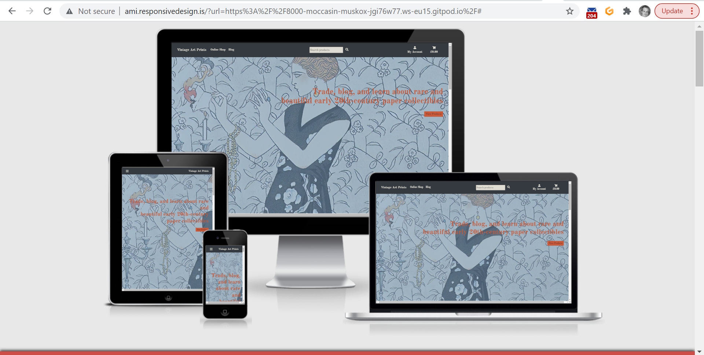
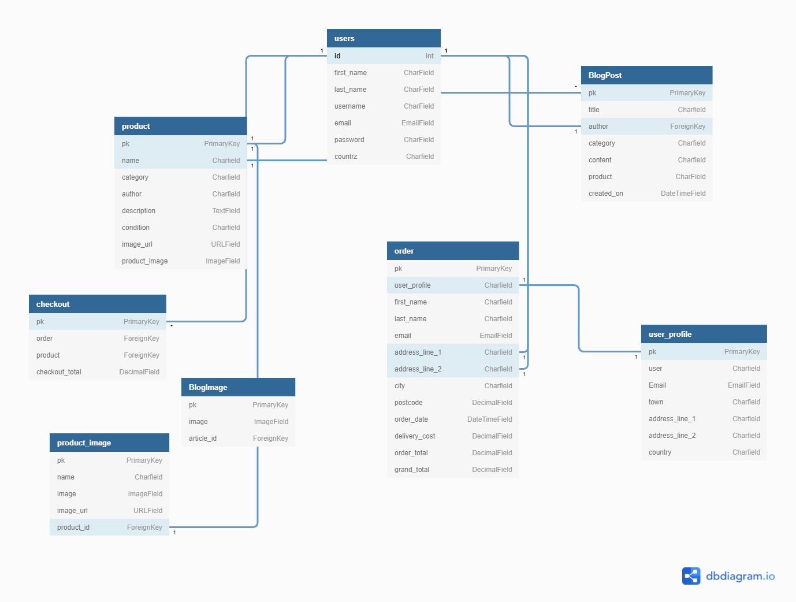

# VAP - Vintage Art Prints



**[Live demo](https://jochenfm-art-prints.herokuapp.com/)**

<span id="top"></span>

## Table of Contents

- <a href="#context">Context</a>
- <a href="#ux">UX</a>
  - <a href="#ux-overview">Overview</a>
  - <a href="#ux-stories">User stories</a>
  - <a href="#ux-wireframes">Wireframes</a>
  - <a href="#ux-design">Design</a>
- <a href="#database-model">Database model</a>
- <a href="#features">Features</a>
  - <a href="#features-current">Existing Features</a>
  - <a href="#features-future">Future Features</a>
- <a href="#technologies">Technologies Used</a>
- <a href="#testing">Testing</a>
- <a href="#deployment">Deployment</a>
- <a href="#credits">Credits</a>
---


<span id="context"></span>

## Context

VAP - Vintage Art Prints allows trade of and information exchange on a fine selection of original art prints from around the globe. 
The project also publishes blog posts for users to exchange information on the paper art advertised and help an online community of paper art traders and affictionados grow. The current focus is on paper collectibles, so-called “Mono-Karten” or “Monos”, advertising cards developed from around 1905 by Swiss editor and entrepreneur Karl Wilhelm Bührer (1861-1917) under the aegis of International Mono Society, equally founded by Bührer in Winterthur, Switzerland. 
But the product range can be expanded later on with related paper- and artwork, such as other types of vintage advertising cards, poster art, and even stamps.
The Mono cards were designed by then young painters such as Emil Cardinaux, Burkhard Mangold or Ludwig Hohlwein and were collected just as present-day soccer or baseball picture cards. Sized 4x6 inches, the picture side usually contained print art, whereas on the reverse was a brief statement explaining the content of the picture, with carefully crafted advertising slogans of the companies involved in the idea.
I find these cards aesthetically appealing – the beauty of the images, the quality of the colours and of the lithographic printing are amazing. 
What I intend to achieve in this project is to bring together two logics commonly kept apart: for one, an educational/informational logic, following examples such as [Monokartenmatthys](https://www.monokartenmatthys.com/) which allows users to display their cards pointing out their historical and artistic value. For another, a business logic to facilitate trade in these cards and possible profit-making, hitherto often undertaken on [Pinterest](https://www.pinterest.ch/michaelv0271/mono-karten-swiss-trade-cards/) or [Ebay](https://www.ebay.de/itm/384356476574?hash=item597d6e669e:g:3aoAAOSwQ3RhKhtp).


<div align="right"><a style="text-align:right" href="#top">Go to index :arrow_double_up:</a></div>


<span id="ux"></span>

## UX

<span id="ux-overview"></span>

### Overview

*VAP* addresses everyone who is interested in paper art and its collection and trade for the purpose of profit-making, information exchange and learning, or just for fun and aesthetics. Users are looking for items to purchase securely and trustworthily, while being able to compare market information such as price and product condition. Some would also like to see content to learn from and educate themselves, while potentially also sharing and discussing some of their knowledge on vintage paper collectibles.    
Moreover, the site owner has some specific business goals which include:

* Provide customers with a secure and smooth e-commerce experience
* Make profit from selling products / services
* Establish the shop's brand identity
* Expand the business effectively

All design decisions have been made with the following goals in mind:
- Accessibility
- Ease of use
- Responsiveness
- Visual appeal


<span id="ux-stories"></span>

### User stories

#### Overarching user expectations

- Consistent
- Easy to navigate
- Intuitive
- Responsive
- Secure
- Visually appealing


#### Viewing and Navigation

| AS A/AN     | I WANT TO BE ABLE TO ... | SO THAT I CAN... |
| ----------- | ----------- | ----------- |
| Site User/ Shopper | access the website with any device | Use the website anytime and anywhere |
| Shopper | Easily see what services are offered | Find the service I want to use |  
| Shopper | All the important services are accesible from nav bar| Don't need to scroll to find important information |
| Shopper | Quickly identify new arrivals | Be alerted of products I might like to purchase || Shopper | View a list of all products | select some to purchase |
| Shopper | View a specific category of products| Quickly find products I am interested in without having to search through all products |
| Shopper | View individual product details| Identify the price, description, product image, condition which it is in |
| Shopper | Easily view the total of my purchase at any time| Avoid overspending |


<br/>

#### Registration, User Accounts and User Community

| AS A/AN     | I WANT TO BE ABLE TO ... | SO THAT I CAN... |
| ----------- | ----------- | ----------- |
| Site User | Easily register for an account | Have a personal account personal account and be able to view my profile |  
| Site User | Easily login or logout | Access my personal account information |
| Site User | Easily recover my password in case I forget it | Recover access to my account |
| Site User | Receive an email confirmation after registering | Verify that my account registration was successful |
| Site User | Post a blog about the paper products or related collectibles | Provide shoppers or interested users with interesting information about the paper collectibles |
| Site User | contact the owner of the website in case I have any issues or questions | Resolve them with the appropriate help |

<br/>

#### Online shopping

| AS A/AN     | I WANT TO BE ABLE TO ... | SO THAT I CAN... |
| ----------- | ----------- | ----------- |
| Shopper | Search a product with keywords | Find the most appropriate products |
| Shopper | View individual product pages that have prices, descriptions, sizes, etc | Get detailed information about the product before purchasing |
| Shopper | Filter by a specific category | Easily find products in a specific category |
| Shopper/Site Owner | Leave/View product reviews with scores | Understand which products are popular with other customers |
| Site Owner | Easily add a new product | Make sure the online site has the latest catalogue |

<br/>

#### Cart, Purchasing and Checkout

| AS A/AN     | I WANT TO BE ABLE TO ... | SO THAT I CAN... |
| ----------- | ----------- | ----------- |
| Shopper | Sort the list of available products | Easily identify the best priced and categorically sorted products |
| Shopper | Search for a product by name or description | Easily find a product that I would like to purchase |
| Shopper | Easily see what I have searched for and the number of results | Quickly decide whether the product I want is available |
| Shopper/site user | Filter blog posts by specific categories | See at a glance whether information is available about a topic I am interested in |

<br/>

#### Cart, Purchasing and Checkout

| AS A/AN     | I WANT TO BE ABLE TO ... | SO THAT I CAN... |
| ----------- | ----------- | ----------- |
| Shopper | Easily select a product and know about the condition it is in | Ensure I purchase the correct product and am not surprised at its condition | 
| Shopper | Easily add a product to my cart and see what is in my cart | Select the right product and double-check whether this is true | 
| Shopper | Easily remove a product from my cart | Delete a wrongly selected product and proceed only with what I intend to buy | 
| Shopper | store my shipping details |Check out easier next time I visit that page |


<br/>

#### Managing Products/Site

| AS A/AN     | I WANT TO BE ABLE TO ... | SO THAT I CAN... |
| ----------- | ----------- | ----------- |
| Site owner | Easily add, update, or delete (new) products |Make sure the products on the site are up-to-date |
| Site owner | Easily add, update, or delete blog posts  | Make sure that the blog posts are up-to-date and remove potentially harmful content |
| Site owner | have a marketplace offering more than just products  | Make sure the customers will have more reasons to come back to the site |
| Site owner | Eoffer a shopping journey that is informative and easy to navigate through |Make sure customers have a pleasant shopping experience and develop trust towards that marketplace |


<div align="right"><a style="text-align:right" href="#top">Go to index :arrow_double_up:</a></div>

<span id="ux-wireframes"></span>

### Wireframes

Wireframes created at the start of the project for **desktop** view can be accessed [here](https://github.com/JochenFM/art_prints_ms4/tree/master/readme_materials/wireframes).

Some of the noteworthy deviations from the plan include:

1. The slider was turned into a singale hero image instead as I wanted to match the overal color scheme with this one image. 
2. The original idea to create a single page website for most of the funcationality was scrapped because hard to implement with Django.
3. Pagination was scrapped on onlineshop displaying all products but a navigation arrow included instead allowing users to move from the bottom to the top of the page. 
4. Pagination was included for the blog, however, for more convenient navigation and better visual overview.
5. A view for individual blog posts not planned on wireframes is now included to allow users to read a single contribution on a separate page. 
6. CRUD functionality for blog posts not planned on wireframes is now fully implemented for registered users to enable update, delete and addition of posts.
7. That includes display of a list of all posts by one particular author in case a user would like to read more from the same author.  


<span id="ux-design"></span>

## Design

### Brand Identity

Vision: Highlight the artistic and aesthetic values of art, especially paper art in a allegedly paper-less age, to users.
Mission: Provide a fine selection of original vintage art prints from around the globe which can be purchased securely online. Venturing to become an online authority in trade and information gathering around paper collectibles and their production from around 1900.
Values: 1. Creativity and Business can go together as shown both by this project and the products on sale. 2. Aesthetics is an important part of human sensual experience and the richness of human (visual) aesthetic expressions should be remembered from across the ages and different parts of the world. 3. Share and bring together knowledge - it is a virtue to share what you know about a particular historical item or situation, and this site aims to gather and dissimenate knowledge to that end as well.  


### Colours

I took the color composition on the hero image as a guide for the site's color scheme, and made sure the dark grey matches the hex code of Bootstrap's dark color (#343a40). [Image Color Picker](https://imagecolorpicker.com/en) helped to find the matching colors and [Coolers](https://coolors.co/) helped produce the palette:

  


This palette reflects the Art Deco and Art Nouveau ambiances germane to the period from which most of the products on display originate. The shades of the four colours do  complement each other as well, and form a nice contrast useful to assist in site navigation.

### Typography

To reflect VAT's brand identity and the art styles predominant in the era this shop focuses on, I chose Google font's [Old Standard TT](https://fonts.google.com/specimen/Old+Standard+TT#about). As mentioned in the font description, "Old Standard reproduces a specific type of Modern (classicist) style of serif typefaces, very commonly used in various editions of the late 19th and early 20th century..." which fits well the historical era of the monocards on display.
The description also mentions that the font represents a "revival of the most common lettertype of the early 20th century" which, again, is this shop sets out to achieve as well in the field of paper art and prints.


### Brand Logo
Logo design is the cornerstone of a brand identity and presents a company's name, product and brand. I used [Canva](https://www.canva.com/en_gb/) to create the brand logo PNG which is now the favicon and in the footer of the site.

 


<div align="right"><a style="text-align:right" href="#top">Go to index: :arrow_double_up:</a></div>

<span id="database-model"></span>


## Database model


### Database choice
- Development phase
**SQLight** database was used for the development which is installed with Django. 

- Deployment phase
**PostgreSQL** was used on deployment stage, which is provided as add-on by Heroku application.

- User model is provided as a default by [Django's authentication system](https://docs.djangoproject.com/en/3.1/ref/contrib/auth/).

### Data Modeling

In order to help me create the ERD (Entity Relationship Diagram), I referred to Launch School [article](https://launchschool.com/books/sql/read/table_relationships) on table relationships. The following schema was created with [dbdiagram.io](https://dbdiagram.io/home):




<div align="right"><a style="text-align:right" href="#top">Go to index: :arrow_double_up:</a></div>

## Features

<span id="features-current"></span>

### Existing Features

This website is composed of 6 applications: `home`, `blog`, `cart`, `checkout`, `products`, `profiles`.


#### Landing Page
This  was originally designed as a single page website to provide site visitors with enough information at one glance to understand what this business is about. The single-page application was then scrapped as difficult to implement with Django on the backend. But still, the landing page in its present provides a minimal amount of information and allows the site visitors to take next actions. 
As the user scrolls down the page, s/he will find sections on `Navbar`, `Hero image`, `About`, `New Arrivals`, and `Contact Form`.
The Art Deco hero image sets the tone, also in terms of color composition, for the entire application. It was originally illustrated in 1921 by Georg Barbier (1882-1932), one of France's great illustrators of the early 20th century, and is entitled "Fumée, Robe du soir de Beer" (see below under image credit for more information). 


#### Navbar
Navbar is fixed at the top, so that users can easily navigate across the entire site. The Navbar contains: `Brand Name`, `Site Menu`, `Search Box`, `My Account dropdown` and `Cart icon`.
- The search box function allows users to search the products on online shop by keywords. Searcheable words are in `name` and `description` and `description` of the Product Model. This function uses "OR" condition not "AND" when searching the keywords, meaning, if the search query was "Mono Boecky", the search result shows the product found using the keyword "Boecky" OR "Mono". 
- Site Menu & My Account dropdown: The site menu collapses into a toggle icon at a width of less than 992px. My Account dropdown, as well as the search field and the cart are included into the toggle menu for smaller screen.
- Cart icon: If user has an item in the cart, the respective sum in £ will show up next to the cart icon, incrementing/decrementing as more products are added/taken out. If cart is empty, £0,00 is shown.

#### About
The `About` section briefly introduces into what this gallery shop is about and gives a brief introduction into its features.

#### Contact Form
Users will find a simple contact form at the bottom of the landing page. Users will fill out fields `name`, `email`, and `message` in order to submit the form. A future feature will allow the email with the inquiry from the form to be sent to the admin of the website (handled by django send_mail() functionality).

#### Footer
The footer section consists of three sections:
 1. Disclaimer and Copyright General information 
 2. Contact in the form of social media icons
 3. Brand logo linked to the index.html


#### Product Pages
#### Online Shop Page
'Online Shop' on the site menu leads to the online shop page where all products are displayed. Alternatively, users can also get there via the button under the h1 on the hero image, or via a further under New Arrivals 'See Collection'. Onlineshop is next to the blog the core application of this site. It contains a drop down menu on the left for users to narrow their search by categories: 
  - Mono Cards
  - Artistic Posters
  - Stamps
  - New Arrivals
  - All Categories

The number of search results is shown above the Narrow Your Search h4. Customers can see how many results were found in total at a glance, or return to the online shop in case of empty returns.

On the right is a drop-down button to filter all products alphabetically by name or category (A-Z and Z-A in each case), or by prize (low to high and high to low).

The products are displayed in cards with fields on `Product Name`, `Price`, `Author`, `Year`, `Category` and a `View Details` button with font awesome icon. If the user is logged in as a superuser, Edit / Delete options are also shown on each card.

### Product Detail Page
- Products are displayed in the center of the page with a larger image section on the left, and the description section on the right. Clicking on the image opens up a new window with a larger depiction of the product. 
- Product Information is displayed as (in order of appearance from top): link to `Category`, `Edit`/`Delete` functionality of logged in as superuser, `Product Name`, `Year`, `Author`, `Price`, `Description`, `Condition`, `Dimension`, and `Quantity`. At the bottom right, two buttons round up this site: `Continue Shopping` and `Add to Cart`. 


### Cart Modal

Upon placing a product in the cart, a modal pops up displaying all the relevant information to the user such as `Number of Items in Cart`, `Quantity` of a single product chosen and thumbnail image of it, `Total excl. delivery cost`, a `banner` displaying a calculation of how much needs to spent in order to qualify for free delivery (currently set at £50 and more), and a button `Got to Secure Checkout`.


### Cart

My cart consists of two of Bootstrap's responsive tables each wrapped in a box-element. The first shows all costs for the user, divided in cart total, delivery and grand total.The overall number of items is also shown and an option to continue shopping via a button leading back to the onlineshop. The second table shows the user's selection, again, with a thumbnail image of the chosen items, title, price, quantity and subtotal. There is also an option to remove the item(s). Thus, users can check their order summary at first glance even if numerous products were added to the cart. A Secure Checkout button leads to the checkout page.

### Checkout Pages
#### Checkout Page
- On the left hand side of the checkout page, customers are asked to fill in their delivery and payment details. If user is authenticated, a tick box allows them choose whether or not they want to have their delivery information saved to their profile. If unauthenticated, an option is given to login to save the information or create an account. Checkout process can be completed without being logged in.
- On the right hand side, another yet smaller table us shown with the order summary.   

#### Checkout Success Page
- A thank you message will be displayed after the checkout process as well as four box elements that hold the order, delivery, and billing information.
- A `Check Out Our New Arrivals` button is placed at the end of the page, which leads to the products site filtered by the new arrivals category. If the user is logged in, a `Back to Profile` button is shown in addition.


<div align="right"><a style="text-align:right" href="#top">Go to index: :arrow_double_up:</a></div>


### Blog Page
#### Blog Feed Page
- After clicking `Blog` on the site menu, a Blog Feed page is loaded. On this page, blog posts will be displayed ordered by date (newest first). Each post is on a box-element with date, author (as link), title (as link), and text body. `Pagination Buttons` are also added at the end of the page. Clicking on the blog post title will open a new site for blog post details. 


#### Blog Post Detail Page

This is a very basic page displaying posts in full length with the author as a link on top.

#### User Blog Posts

Upon click on the author, displays all posts by that individual author. Posts are counted in the page header behind the respective author's first name. `Pagination Buttons` are also added at the end of the page. 

#### Add/Edit Blog
- If user is logged in and is the author of blog posts, they can edit and delete their posts from the post detail page via a post_edit page, which is prefilled with the post content to be edited. 
New posts can be added by logged in users via 'New Post' in the navbar drop down menu under My Account.


#### Profiles Page
Link to `My Profile` page shows for authenticated users in the navbar drop-down menu under `My Account`. On the My Profile page, authenticated users can edit `Delivery Information` and see their `Order History`.

### Admin Product Managment
Authenticated superusers can access the admin page to add, edit and delete products via the respective templates. Relevant toast messages will pop up alerting the user that products are being edited, confirming deletion, or showing success in case a product was added. If a non-superuser tries to access the edit or delete url the 404 error page pops up. If non-logged in users try to access the urls directly, s/he will be redirected to the sign in page and will be shown a message "Sorry, only store owners can do that" once log in proves user is not the superuser.

### Django-allauth features

- Sign Up: The users will be asked to fill out `E-mail` (twice), `User Name` and `Password` (twice) to create an account. When the sign up form is submitted, a verification email will be sent to the user's email address to complete the sign up process by clicking the link sent in the email. 
- Log In: Users will be asked to input `User Name` or `Email`, and `Password` to login. If the user successfully logged in s/he will be redirected to the landing page and a modal shows "Successfully signed in as _username_."
- The Log out page can be accessed from the site menu in the navbar. After the user successfully signed out via the logout button on the sign out page, a success message will appear and s/he will be redirected to the landing page.
- In case user has forgotten their password, a link on the Sign In page allows them to access the Password Reset page where they will be asked to insert the email address used for their registration. An email with a link to reset the password will be sent upon submitting the form.


### Defensive Design
#### Error views (404 and 500 errors)
In case of 404 and 500 errors, the respective html templates are engaged, with a 'Back Home' button so that the user has the option to stay on the site. The templates of 404.html and 500.html are added to the root template directory.


<span id="features-future"></span>

## Future Features

There are a number of features which I would have loved to implement but failed to due to lack of skills and, especially, time constraints. These additions would help the overall functionality of VAP and lead to higher customer satisfaction and profitability if this is ever going to go live. Some of the features are: 

**1. Contact Form on Index.html**

The email address field could be prefilled if the user is logged into their account. Moreover, a future feature will allow the email with the inquiry from the form to be sent to the admin of the website (handled by the Django send_mail() functionality).

All products of the new_arrival category onindex.html will need a NEW sticker or similar in the top corner to set them apart from the rest of the product line.

**2. Customer Testimonials**

A testimonial section in form of a carousel on index.html whereby past customers leave rating/quote of their shopping experience would be good to build trust between shop and potential users/customers. 


**3. Footer**

Social Media icons are currently linked to my personal social media accounts, but in a real settting they should be linked to business pages on social media, such as Facebook, Instragram, Twitter, Pinterest etc, for social media marketing purposes. And login functionalities could then be synchronized between this App and social media (see below)


**4. Product Details**

A link behind the artist/author name that would allow display of all products available under the respective name via Django's get_queryset(), for instance. 

I also would have loved to implement one of these [Jquery-az](https://www.jquery-az.com/4-demos-to-create-product-galleries-with-zoom-feature-by-jquery/) zoom functionalities upon mouseover the single product images as the style and condition of paper collectibles is an important criteria for customers during purchase. 

A future version will need thumbnail images of both front and reverse side of the cards, placed below each individual product card allowing users to choose which one to view. This requires adding images of the product's reverse side to the database and match them with the front page image.

The quantity section is perhaps superfluous in my case, as I usually sell unique collectibles of which I may not have more than one for sale. This also means, that in the application's current state, users can add the same item multiple times, without that either the quantity of products on stock would decrease, nor the overall total in their cart inrease.


**5. Checkout**

At the moment, the application does not collect user's billing information within the User Profile model or Order model.(However, the billing data is recorded in Stripe from the billing information added by the customer.) One of the features left to implement is to add the billing details on the Checkout page.

**6. Blog Pages**

Insert a header/hero image in blog.html to invite more users to contribute.

Implement categories of blog posts so users can navigate the blog posts easily. Numbers of posted blogs in the respective categories could also shown in brackets.

Add superuser functionality to allow the site admin to edit and delete blog posts (via 

My Profile does not collect any user information from the blog app - both app and store are generally hardly interlinked. This could be improved for users who are both shoppers and bloggers. 
Moreover, products that are the object of blog posts could also be linked to the shop in order to enhance information exchange and help users decide what to buy and why. 

**7. Social Account Login**
This function allows users to sign up / log into their VAP account using an existing third party account such as Google or Facebook. For users, this would make it easier to memorize the password and speeds up the registration process. The site owner would benefit from increasing user sign ups, reduced bounce rate and by gaining access to the user's social account details which helps with marketing.


**8. Larger Database**
The database and categories to date is rather limited and I would love to add further items and categories at a later stage. Allowing, for instance, the search by artistic epoch, geographical region, and theme such as inserted manually in the site's current state on index.html which shows a selection of new_arrival- products all with hen/rooster depictions. 


<div align="right"><a style="text-align:right" href="#top">Go to index: :arrow_double_up:</a></div>

<span id="technologies"></span>

## Technologies Used

The main frontend development was created using HTML, CSS, JavaScript and their libraries. The main backend development is powered by Python and Django.


### Languages


- [CSS](https://developer.mozilla.org/en-US/docs/Web/CSS) to style HTML and dynamic elements.
- [HTML](https://developer.mozilla.org/en-US/docs/Web/HTML) is the markup language for the site layout.
- [Javascript](https://developer.mozilla.org/en-US/docs/Web/JavaScript) to create and manipulate the site's client-side dynamic elements.
- [Python](https://www.python.org/) for the backend server and running queries to the database.

### Libraries and Packages

- [Django](https://www.djangoproject.com/)
- [Django Crispy Forms](https://django-crispy-forms.readthedocs.io/en/latest/)
- [Django Allauth](https://django-allauth.readthedocs.io/en/latest/installation.html)
- [Bootstrap (v4.4.1)](https://www.bootstrapcdn.com/)
- [JQuery](https://jquery.com/)
- [Stripe](https://stripe.com/ie)


### Project management

- [Balsamiq](https://balsamiq.com/wireframes/) to create the wireframes for this project.
- [GitHub](https://github.com/) to store the project repository and deploy the site
- [GitPod](https://gitpod.io/) for version control.
- [Heroku](https://www.heroku.com/about) is the deployment platform.
- [dbdiagram](https://dbdiagram.io/home) to create Entity Relationship diagram of the database.
- [AWS S3 bucket](https://aws.amazon.com/) to store all static files and images. 

### Tools

- [Am I Responsive?](http://ami.responsivedesign.is/) to generate images across different devices' screen sizes.
- [Autoprefixer](https://autoprefixer.github.io/) to ensure CSS compatibility across different browsers.
- Alicia Ramirez' [Closing Tags Checker](https://www.aliciaramirez.com/closing-tags-checker/) to check if all tags are closed properly. 
- [Coolers.co](https://coolors.co/) to help create the color palette used across the site.
- [Devoth‘s HEX 2 RGBA Color Calculator](http://hex2rgba.devoth.com/) to generate the rgba from hex values for inclusion in CSS.
- [Favicon.io](https://favicon.io//) to create the brand logo icon in the browser tab.
- [Canva](https://www.canva.com/en_gb/) to create the brand logo PNG 
- [Font Awesome](https://fontawesome.com/) for all (button) icons.
- [Google Fonts](https://fonts.google.com/) for the font of this site.


<div align="right"><a style="text-align:right" href="#top">Go to index: :arrow_double_up:</a></div>


<span id="testing"></span>

## Testing


Full details of testing can be found [here](TESTING.md).


<span id="credits"></span>

## Deployment
### Heroku Deployment with AWS
This website has been deployed on [Heroku](https://www.heroku.com/) by following these steps:
1. Install the following packages to your local environment as required to deploy a Django project on Heroku.
- [gunicorn](https://gunicorn.org/) which is a Python WSGI (web server gataway interface).
- [psycopg2-binary](https://pypi.org/project/psycopg2-binary/) which is a PostgreSQL database adapter for Python.
- [dj-database-url](https://pypi.org/project/dj-database-url/) which allows utilization of the 12factor inspired DATABASE_URL environment variable to configure your Django application.
2. Create a `requirements.txt` file and freeze all the modules with the command `pip3 freeze > requirements.txt` in the gitpod terminal.
3. Create a `Procfile` write `web: gunicorn art_prints.wsgi:application` in the file.
4. `git add` and `git commit` and `git push` all the changes to the Github repositoty of this project.
5. Go to Heroku and create a **new app**. Set a name for this app and select the closest region (Europe) and click **Create app**.
6. Go to **Resources** tab in Heroku, then in the **Add-ons** search for **Heorku Postgres**, select **Hobby Dev — Free** and click **Submit Order Form** button to add it to your project.
7. In the heroku dashboard for the application, click on **Setting** > **Reveal Config Vars** and set the values as follows:

| Key | Value |
| ----------- | ----------- |
| AWS_ACCESS_KEY_ID | `Your AWS Access Key` |
| AWS_SECRET_ACCESS_KEY | `Your AWS Secret Access Key` |
| DATABASE_URL | `Your Postgres Database URL` |
| EMAIL_HOST_PASS | `Your Email Password (generated by Gmail)` |
| EMAIL_HOST_USER | `Your Email Address` |
| SECRET_KEY | `Your Secret Key` |
| STRIPE_PUBLIC_KEY | `Your Stripe Public Key` |
| STRIPE_SECRET_KEY | `Your Stripe Secret Key` | 
| STRIPE_WH_SECRET | `Your Stripe WH Key` |
| USE_AWS | `True` |


* I used [Miniwebtool](https://miniwebtool.com/django-secret-key-generator/) to generate the Django Secret Key.

8. Comment out the current database setting in settings.py, and add the code below instead. This is a temporarily measure only to migrate the datbase on Heroku.
```
  DATABASES = {     
        'default': dj_database_url.parse("<your Postrgres database URL here>")     
    }
```
9. Migrate the database models to the Postgres database using:
`python3 manage.py migrate`
**10. Load the data fixtures into the Postgres database using:
`python3 manage.py loaddata <fixture_name>`**
11. Create a superuser for the Postgres database by running:
`python3 manage.py createsuperuser`
12. Replace the database setting with the code below, so that the right database is used depending on whether environment is in development or deployed.
```
if 'DATABASE_URL' in os.environ:
    DATABASES = {
        'default': dj_database_url.parse(os.environ.get('DATABASE_URL'))
    }
else:
    DATABASES = {
        'default': {
            'ENGINE': 'django.db.backends.sqlite3',
            'NAME': os.path.join(BASE_DIR, 'db.sqlite3'),
        }
    }
```
13. Disable collect static, so that Heroku won't try to collect static file with: `heroku config:set DISABLE_COLLECTSTATIC=1`
14. Add `'jochenfm-art-prints.herokuapp.com', 'localhost'` to `ALLOWED_HOSTS` in settings.py.
```
ALLOWED_HOSTS = ['jochenfm-art-prints.herokuapp.com', 'localhost'']
```
15. In Stripe, add the Heroku app URL a new webhook endpoint.
16. Update the settings.py with the new Stripe environment variables and email settings.
17. Commit all the changes to Heroku. Media files are not connected to the app yet but the app should be working on Heroku.

### Amazon Web Service S3
The static files and media files for this deployed site (e.g. image files for all products) are hosted in the [AWS](https://aws.amazon.com/) S3 Bucket. You will need to create a S3 bucket, complete the set up and upload static files and media files. See [Amazon S3 documentation](https://docs.aws.amazon.com/AmazonS3/latest/gsg/CreatingABucket.html) for more information.


- Setting for static/media files in settings.py
1. Install `boto3` and `django-storages` with a command `pip3 install boto3` and `pip3 install django-storages` in your terminal, to connect AWS S3 bucket to Django.
2. Add 'storages' to `INSTALLED_APPS` in settings.py.
3. Add the following in settings.py.

```
if 'USE_AWS' in os.environ:
    # Cache Control
    AWS_S3_OBJECT_PARAMETERS = {
        'Expires': 'Thu, 31 Dec 2099 20:00:00 GMT',
        'CacheControl': 'max-age=94608000',
    }

    # bucket config
    AWS_STORAGE_BUCKET_NAME = 'jochenfm-art-prints'
    AWS_S3_REGION_NAME = 'eu-west-2'
    AWS_ACCESS_KEY_ID = os.environ.get('AWS_ACCESS_KEY_ID')
    AWS_SECRET_ACCESS_KEY = os.environ.get('AWS_SECRET_ACCESS_KEY')
    AWS_S3_CUSTOM_DOMAIN = f'{AWS_STORAGE_BUCKET_NAME}.s3.amazonaws.com'

    # Static and media files
    STATICFILES_STORAGE = 'custom_storages.StaticStorage'
    STATICFILES_LOCATION = 'static'
    DEFAULT_FILE_STORAGE = 'custom_storages.MediaStorage'
    MEDIAFILES_LOCATION = 'media'

    # Override static and media URLs in production
    STATIC_URL = f'https://{AWS_S3_CUSTOM_DOMAIN}/{STATICFILES_LOCATION}/'
    MEDIA_URL = f'https://{AWS_S3_CUSTOM_DOMAIN}/{MEDIAFILES_LOCATION}/'
    

```
5. Add [custom_storages.py](https://github.com/JochenFM/art_prints_ms4/blob/master/custom_storages.py).
6. Delete DISABLE_COLLECTSTATIC from Heroku Config Var.
7. Push all the changes to Github/Heroku and all static files will be uploaded to S3 bucket.
By the above setting, Heroku will run python3 manage.py collectstatic during the build process and look for static and media files.

### Automatic Deploy on Heroku
You can enable automatic deploy as follows (so that updates to Github will automatically update Heroku as well):
1. Under the Deploy tab in the Heroku dashboard, go to `Automatic deploys`
2. Choose the github repository you want to deploy.
3. Click `Enable Automatic Deploys`.


### Local Deployment
For local deployment, an IDE is needed (e.g. Gitpod) and you need to install the following:
- Git, Python3, PIP3
Also, you need to create an account for each of the following services if not already done so:
- Stripe, AWS (S3 bucket), Gmail

1. In the IDE you are using, copy and paste the following command into the terminal to clone this repository.
    `git clone https://github.com/JochenFM/art_prints_ms4.git`
(other ways to clone a repository can be found here [GitHub documentation](https://docs.github.com/en/free-pro-team@latest/github/creating-cloning-and-archiving-repositories/cloning-a-repository))
2. Set up environment variable in your selected IDE, or you can create `.env` file in your root directory and add `.env` to `.gitignore` file, and add the followings to the `.env` file.
```
import os  
os.environ["DEVELOPMENT"] = "True"    
os.environ["SECRET_KEY"] = "<Your Secret Key>"
os.environ["STRIPE_PUBLIC_KEY"] = "<Your Stripe Public Key>"    
os.environ["STRIPE_SECRET_KEY"] = "<Your Stripe Secret Key>"    
os.environ["STRIPE_WH_SECRET"] = "<Your Stripe WH Secret Key>"    
```
3. Install all the required packages with `pip3 install -r requirements.txt`
4. Migrate the models to create a database using in your IDE with `python3 manage.py makemigrations` and `python3 manage.py migrate`
**5. Load the data fixtures into the database using the following command:
`python3 manage.py loaddata <fixture_name>`**
6. Create a superuser for the Postgres database by running with `python3 manage.py createsuperuser`
7. Now you can access the app using the command `python3 manage.py runserver`

<div align="right"><a style="text-align:right" href="#top">Go to index: :arrow_double_up:</a></div>


## Credits

### Tutorials / Resources

- Documentations of [Bootstrap](https://getbootstrap.com/docs/4.0/getting-started/introduction/) and [Django](https://docs.djangoproject.com/en/3.1/) were key throughout the development process.  

- Code Institute's [Boutique Ado](https://github.com/Code-Institute-Solutions/boutique_ado_v1) Project from which I adapted much of the e-commerce logic, database setup, and code

- Corey Shafer's [Python Django Tutorial: Full-Featured Web App](https://www.youtube.com/playlist?list=PL-osiE80TeTtoQCKZ03TU5fNfx2UY6U4p), especially parts 2, 3, 10, and 11 which helped me set up the blog and implement pagination.

- Web Development Tutorials' [tutorial](https://www.youtube.com/watch?v=ZhTnOp-FpE0) and Drew Ryan's [tutorial](https://www.youtube.com/watch?v=Zn64_IVLO88) for some inspiration on the Bootstrap 4 Jumbotron Background Image on Landing Page 

- Dennis Ivy's [Django Ecommerce Website tutorial](https://www.youtube.com/watch?v=_ELCMngbM0E) provided some styling ideas for my cart.

- Email contact form on index.html is adjusted from [this example](http://reusableforms.com/d/e1/bootstrap-contact-form-send-email) at Reusable Forms

- Footer with three-column layout is adjusted from [Ordinary Coders](https://www.ordinarycoders.com/blog/article/bootstrap-footers)

- Stackoverflow has been important, such as [How do I display my products by certain category](https://stackoverflow.com/questions/65017961/how-do-i-display-my-products-by-certain-category) for display of new_arrivals-products on index.html, but no code was taken from it.  

- In terms of layout and style, as well as the overall business idea, the following live websites were an inspiration:
  - [Galerie 123](https://www.galerie123.com/en/)
  - [King & McGaw](https://www.kingandmcgaw.com/prints/vintage) 
  - [Retrographik](https://retrographik.com/)


### Acknowledgments

A number of Code Institute's tutors were of great help. Many thanks to:

- Sheryl Goldberg
- Igor Basuga
- John Traas
- Michael Park
- Kevin Loughry

without whom this site would not be what it is now.

Special thanks also to my fellow students on Slack.

Some MS4s were a great inspiration for this project, especially Asuna Masuada's [Flowery Days](https://flowerydays.herokuapp.com/) whose detailed section in her READEME file on deployment I adapted here.

Thanks also to my mentor [Adegbenga Adeye](https://github.com/deye9) for his encouragement and for generously sparing an extra hour to try and help me display the products of the 'new arrivals' category on index.html


### Image Credits

Hero image:

* Hero image is from [Unsplash](https://unsplash.com/photos/6NSVToSYwV0) and is free to use under the Unsplash license. Created under the title "Fumée, Robe du soir de Beer", it first appeared in 1921 in Gazette du bon ton : art, modes & frivolités and was digitalized for a 2009 exhibition by the McGill University Library's [Digital Exhibitions & Collections](https://www.mcgill.ca/library/find/digitization) entitled ["Art Deco and the Decorative Arts in the 1920s and 1930s"](https://digital.library.mcgill.ca/artdeco/). 

* All Mono cards are from this [Pinterest account](https://www.pinterest.ch/michaelv0271/mono-karten-swiss-trade-cards/) and from [Monokartenmatthys](https://www.monokartenmatthys.com/).

* The to-date only artistic poster in the collection, Robert Hardmeyer's Waschanstalt Zurich AG
(1904), is from [New York's Museum of Modern Arts](https://www.moma.org/collection/works/5352)

* The no-image icon is from [FreeIconsPng](https://www.freeiconspng.com/images/no-image-icon)


