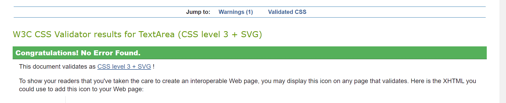

Back to [README](README.md)

## Index

- <a href="#testing-manual">Manual Testing</a>
- <a href="#testing-auto">Automated Testing</a>
- <a href="#testing-responsive">Responsiveness</a>
- <a href="#testing-resolved">Resolved issues</a>
- <a href="#testing-unresolved">Unresolved issues</a>

---

## Manual testing

The following tests have been carried out without issue:

**Navigation bar**

On screen widths greater than 991px:
The correct menu options appear depending on the user's session status:
  - **Not logged in**: Brand Title, Online Shop, Blog, My Account with Log In and Register, Cart 
  - **Logged in**: Brand Title, Online Shop, Blog, My Account with My Profile, New Post, and Logout, Cart
  - **Logged in as superuser**: Brand Title, Online Shop, Blog, My Account with with Product Management, My Profile, New Post, and Logout, Cart
- Tapping/clicking each link takes the user to the relevant page, or logs the user out.
- Clicking on Navbar brandlogo takes user back to index page.

Smaller than 991px:
 
- The available menu options are replaced by a hamburger icon.
- All available menu options appear in a drop down nav when the hamburger icon is tapped/clicked, including the search bar. 
- VAP Brand title in Navbar and hamburger menu icon swap sides.

**Footer**

- The footer has a simple three-column layout and 'sticks' on the bottom of the screen with only basic content, inlcuding the brand logo.
- Below 991px, it responsively turns to one column.
- Each social media link opens the relevant external page in a new window.

**Home page**

- All links in the navbar direct to the correct pages.
- The hero image with a header introduces to the main purpose and functionality of the app and allows users to directly proceed to the onlineshop via the View Products button.
- The "About" section introduces to the main idea and purpose of this app. 
- "New Arrivals" shows all products categorized as new arrivals.
- "Contact" section allows users to get in touch via email in case they need to (not functional yet in the app's current state)

**Log In page**

- Entering a username or password not matching the form validation highlights the issue to the user via red color first and, upon clicking/tapping Login button, a tooltip "Please match the requested format"
- Entering either an incorrect username or password triggers a Flash message "Incorrect Username and/or Password".
- When the 'Log In' button is tapped/clicked with valid details, the user is redirected to their Profile page and a Flash message including their username indicates they have successfully logged in.
- The 'Register' link below the login fields takes the user to the Register page.

**Register page**

- Entering a username or password not matching the form validation highlights the issue to the user via red color first and, upon clicking/tapping Register button, a tooltip "Please match the requested format"
- Submitting a username (upper or lowercase) which has already been registered reloads the page and displays a Flash message "Username already exists"
- When the 'Register' button is tapped/clicked with valid details, the user is redirected to their Profile page and a Flash message indicates "Registration successful"
- On registering, the new user's username and password are added to the Users collection on MongoDB.
- The 'Log In' link below the Register fields takes the user to the Log In page.

**Video Library page**

Search functionality:

- After entering a term in the search field and either tapping/clicking the search icon or pressing Enter, the correct results are displayed as long as number of results is in excess of pagination PER_PAGE limit.
- Tapping/clicking the cancel icon reloads the page with no query applied.
- The section heading updates to reflect the search term used.
- If no results are found, a Flash message appears "No results found".

Video Containers & Collapsibles:

- All test videos in the database are displayed, each with the title, author, abstract, venue, and date as inserted by the user. 
- All videos can be watched with sound on/off, either on full, small screen, or picture in picture mode. They can also be downloaded.
- Videos are displayed with the oldest at the top (sorting the video_id not yet implemented).
- If the user is logged in and has added a video, the edit interface is displayed within the collapsible title field comprising edit, delete, and 'like' icons. The like functionality is inactive for now, but the edit and delete icons lead the user respectively to the edit video page or to a modal with further options of cancel or delete video.
- Like icon has hover effect on moused over.

Pagination:

- The number of visible videos is limited to 4 per page.

**Add Video page**

- The large 'Upload Video' button at the top of the form is wired to the Cloudinary upload widget which upon tapping/clicking the button pops up for the user to upload a video.
- The widget is customized to currently allow three different upload methods: via my files, web adress (public URL), or google drive. The first option can be performed either by drag and dropping the video file into the upload widget, or by browsing their files.
- Currently, the video needs to be uploaded before all other fields are being filled in, otherwise the form will be submitted without video.
- Upon tapping/clicking 'Done' on the widget, a unique URL for the video on Cloudinary is added to the video link field on the upload form, and the user can continue filling in the remaining fields of Title, Author/Presenter, Video Abstract, Venue, Date, and Video Category.
- The 'Choose category' input field is populated with the document from the Categories collection on MongoDB. Changes to that list, which currently stands at 14 categories, by the Admin or creator of this site are reflected in the dropdown.
- Input field validation and character limitations function as expected, indicating issues with input.
- The 'Add Video' button:
  - Adds the video to the video collection.
  - Redirects to the user to the video library page, showing the new video at the end of the video collapsibles.
  - Displays a Flash message confirming video has been successfully added.

**Edit Video page**

The same tests as for Add Video were undertaken, with the following additional tests:
- The input fields are prepopulated with the video's existing values where available.
- The 'Save Changes' button:
  - Changes the videos's values in the vieos MongoDB collection.
  - Displays a Flash message confirming activity has been successfully added.
  - Redirects user to video library page.

**Manage Categories page**

- The page is only accessible if logged in as "Admin".
- All categories from the MongoDB categories collection are shown in cards.
- The edit/delete icons allow the Admin to either proceed to the edit category form, or delete a category via a confirm delete modal.

**Add/Edit Category pages**

- The pages are only accessible if logged in as Admin.
- Categories can be added via the 'Add Category' button on the Manage Categories page which leads the Admin to a single field to insert a new category name. 
- The delete icon on the Manage Categories page is wired up to a confirm delete modal which also offers the option to cancel.
- The edit icon leads the Admin to the 'Edit Category' template almost identical to the 'Add Category' on which the category name can be updated.

**Profile page**

- Unfinished as yet.
- Username interjected dynamically into profile card.
- Icons to edit and delete icon in place, but only the latter is functional bringing up a confirmation modal with option to cancel.
- Username's favourite and uploaded videos show with content to be added at a later stage from MongoDB and Cloudinary.

<a style="text-align:right" href="#top">Go to index :arrow_double_up:</a>

## Automated testing

[W3C - CSS](https://jigsaw.w3.org/css-validator/) returned:

In response to the [W3C - HTML](https://validator.w3.org/) errors shown:

- I removed a number of stray div tags and closed missing tags for div, p, span, button and form elements.
- I deleted wrong or unnecessary labels, roles and types for form and scripts elements.

I left the "Warning: The type attribute is unnecessary for JavaScript resources." as it is.

[CSS Lint](http://csslint.net/) - 0 errors, 47 warnings - **PASS**

- I removed unit specification behind 0 values
- In one instance warning was for "overqualified elements" - the fontawesome shopping cart icon in the navbar, for which I removed the i element accordingly.
- many warnings refer to "Require compatible vendor prefixes" or "Disallow duplicate properties" both of which were added by autoprefixer and left untouched by me.
- Others discourage the use of id for selectors or adjoining classes ("Don't use IDs in selectors", "Don't use adjoining classes.") Selecting via IDs, however, 
has only been used for styles which will not be reused and the specificity was needed.

- LightHouse on Google DevTool
Lighthouse tests were conducted on the Landing Page, Online Shop Page/Single Product Page, Blog Page, Cart Page.

Results for Performance, Accessibility, Best Practices, and SEO were all in the region between 68% and 100%.

In light of the Lighhouse Reports, improvements at a later stage need to be implemented on:

- Performance on landing page which currently is at 81% due to:
  - Image in PNG format which could be replaced with that of WebP and AVIF which often "provide better compression than PNG or JPEG, which means faster downloads and less data consumption."
  - Render-blocking resources such as critical JS/CSS which could go inline in the future.

- Performance on online-shop for pretty much the same reasons as in the previous point with the addition that Lighthouse suggested to properly size the images "to save cellular data and improve load time."

- Accessibility on the onlineshop page is currently at 85% due to
  - social media links in the footer having an `[aria-hidden="true"]` element which "prevent those interactive elements from being available to users of assistive technologies like screen readers." As I did not see the element, issue was left unchanged for now.
  - The blue Edit element on the cards apparently does not have "sufficient contrast ratio" between background and foreground colors.

- Performance of the product_detail page was hampered by the fact that "image elements do not have explicit width and height" which definitely needs to be addressed at a later stage by following these [web.dev ideas](https://web.dev/optimize-cls/?utm_source=lighthouse&utm_medium=devtools#images-without-dimensions).

<a style="text-align:right" href="#top">Go to index :arrow_double_up:</a>

## Responsiveness

The site is supported by [Bootstrap](https://getbootstrap.com/) and has been thoroughly tested at all stages of development using [Chrome DevTools](https://developers.google.com/web/tools/chrome-devtools).
Bootstrap may limit design choices and customization at times, but this was an acceptable compromise given the advantages provided, such as a fluid responsive grid system which was used throughout this site, including the container class and a number of Components, such as buttons, Contents, such as tables, and Utilities (Display, Position etc.) 

<a style="text-align:right" href="#top">Go to index :arrow_double_up:</a>

### Browsers

Tested on:

- Chrome
- Edge
- Firefox
- Safari (iOS)

### Screen sizes

Tested with Chrome DevTools using profiles for:

- Galaxy S5
- Pixel 2
- iPhone 5 SE
- iPhone 6/7/8
- iPhone X
- iPad Pro

I also used the responsive profiles of:

- Mobile M (375px)
- Mobile L (425px)
- Tablet (768px)
- Laptop (1024px)
- Laptop L (1440px)

Real world testing on:

- iPad Air 
- iPhone 11
- MacBook Air
- ASUS VivoBook 14/15
- Huawei P Smartphone  

<a style="text-align:right" href="#top">Go to index :arrow_double_up:</a>

## Issues and bugs

### Resolved

